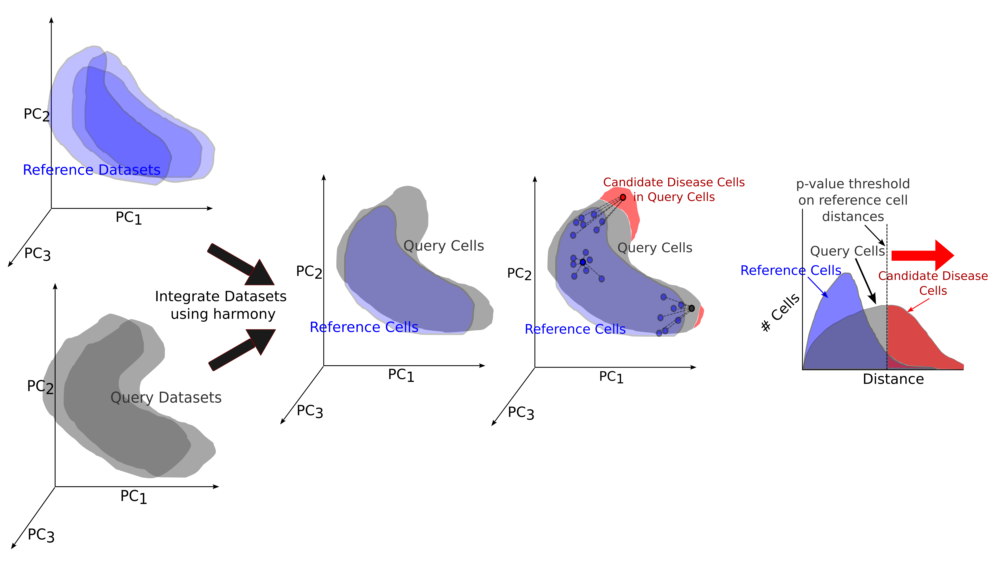

# scPSS: single-cell Pathological Shift Scoring

[](https://www.biorxiv.org/content/10.1101/2024.11.27.625593v1)
[](https://www.python.org/)

A statistical framework for quantifying pathological progression in single-cell transcriptomics data by measuring shifts from healthy reference states.



## Overview

scPSS (single-cell Pathological Shift Scoring) is a computational method that:
- Quantifies how much individual cells deviate from healthy reference states
- Provides statistical measures for pathological shifts in diseased samples
- Enables condition prediction at both cellular and individual levels

## Installation

```bash
pip install git+https://github.com/SaminRK/scPSS.git
```

## Quickstart
```Python
import scanpy as sc
from scpss import scPSS

# Load your data
adata = sc.read("anndata.h5ad")

# Initialize scPSS with your data
scpss = scPSS(
    adata,
    sample_key="sample",              # Column name for sample IDs
    reference_samples=[
        "reference_sample_1",
        "reference_sample_2",
    ],                                # List of reference sample IDs
    query_samples=["query_sample_1", "query_sample_2"],
)                                     # List of query sample IDs

# Run the analysis
scpss.harmony_integrate()
scpss.find_optimal_parameters()
scpss.set_distance_and_condition()

# Access pathological distances
distances = scpss.ad.obs["scpss_distances"]
```

## Reproducibility

The code to reproduce the results in our paper is available at [scPSS-reproducibility](https://github.com/SaminRK/scPSS-reproducibility).


## Citation

If you use scPSS in your research, please cite:

```bibtex
@article{Khan2024.11.27.625593,
    author = {Khan, Samin Rahman and Rahman, M. Sohel and Samee, Md. Abul Hassan},
    title = {Quantifying Pathological Progression from Single-Cell Data},
    journal = {bioRxiv},
    year = {2024},
    doi = {10.1101/2024.11.27.625593},
    URL = {https://www.biorxiv.org/content/10.1101/2024.11.27.625593v1}
}
```
